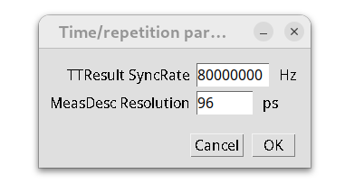

# PTU_Writer
[FIJI](http://fiji.sc/) plugin generating PicoQuant ptu FLIM TTTR image file given a stack with lifetimes.  
Reverse-engineering of [PTU_Reader](https://github.com/UU-cellbiology/PTU_Reader) plugin.  

## How to install plugin

1. You need to download and install [FIJI](http://fiji.sc/#download) on your computer first.
2. [Download *PTU_Writer_...jar*](https://github.com/ekatrukha/PTU_Writer/releases) and place it in the "plugins" folder of FIJI.
3. Plugin will appear as *PTU_Writer* in FIJI's *Plugins* menu.

## How to run plugin

1. Click *PTU_Writer* line in ImageJ's *Plugins* menu.
2. In the following dialog select a TIF Z-stack, where Z corresponds to the "lifetime counts". Only 8- and 16-bit single channel stacks are supported for now.
3. Plugin will ask for "time resolution" metadata parameters:  
   
where *TTResult_SyncRate* is the laser repetition rate (in Hz) and   
*MeasDesc_Resolution* is the time between "lifetime counts", i.e. time between two neighboring input z-slices (in ps). 
4. In a new (last) dialog choose the folder and name for the output PTU file.

## Updates history
v.0.0.1 (2024.11) First release.

---
Developed in [Cell Biology group](http://cellbiology.science.uu.nl/) of Utrecht University.  
Email katpyxa @ gmail.com for any questions/comments/suggestions.
